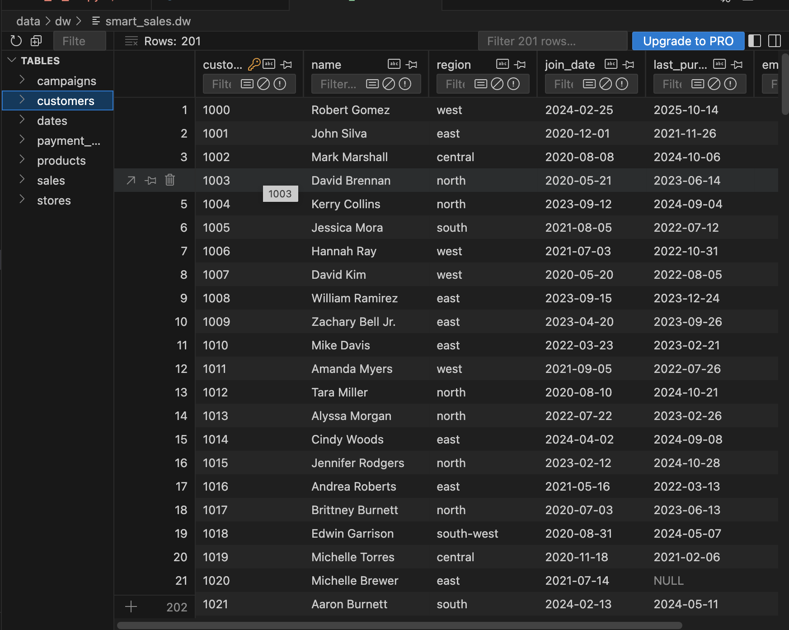
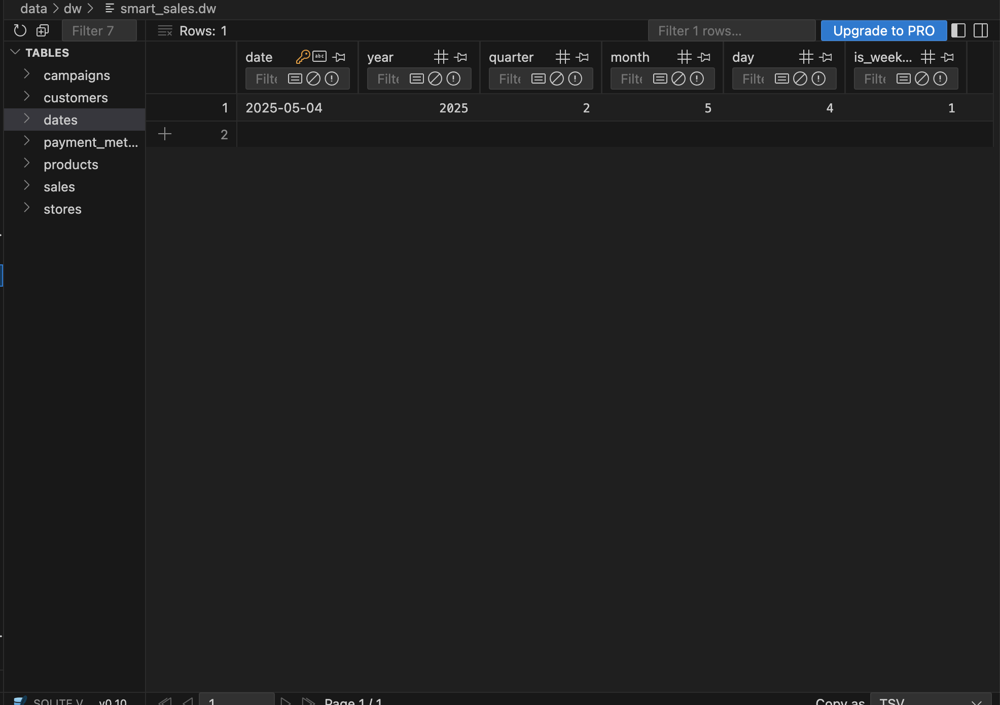
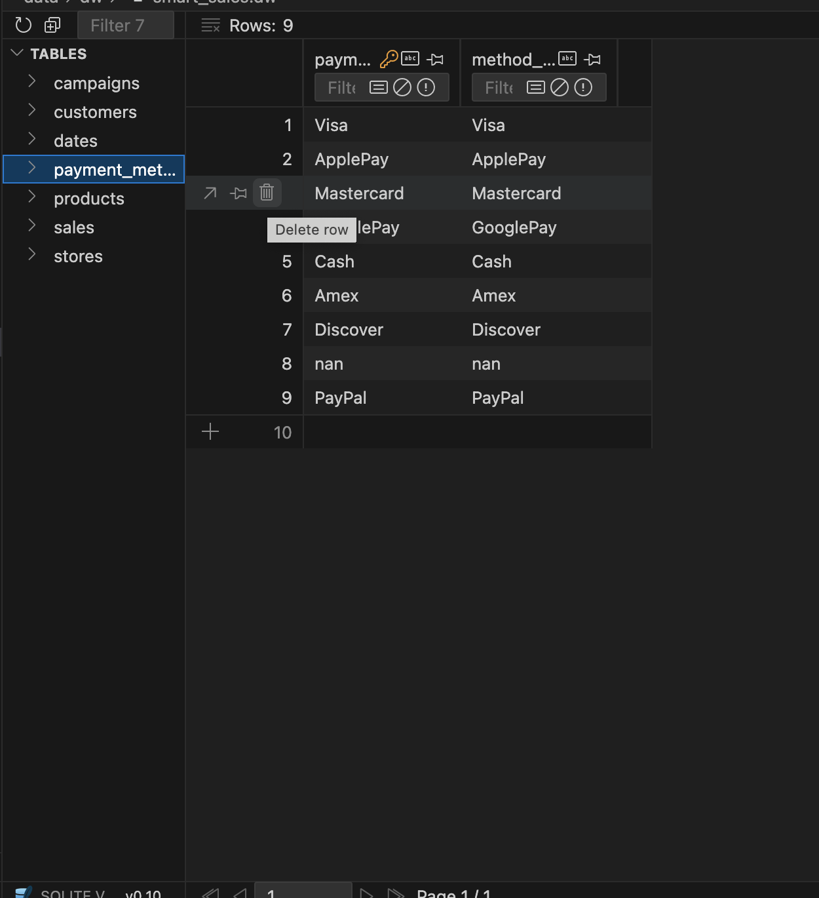
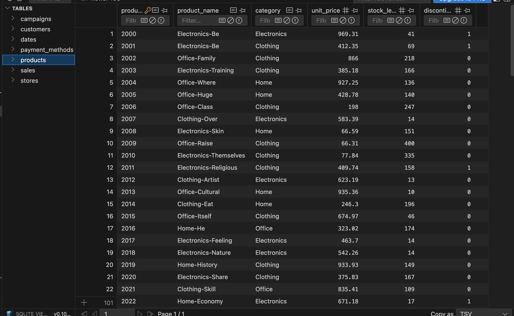
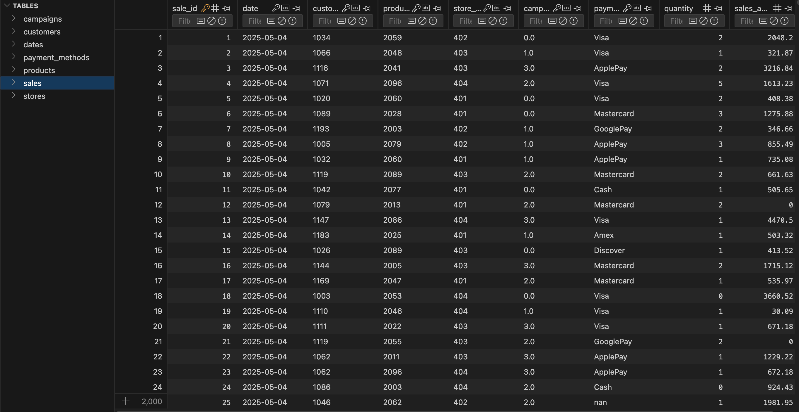
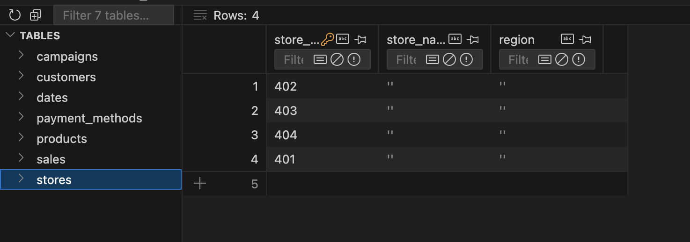
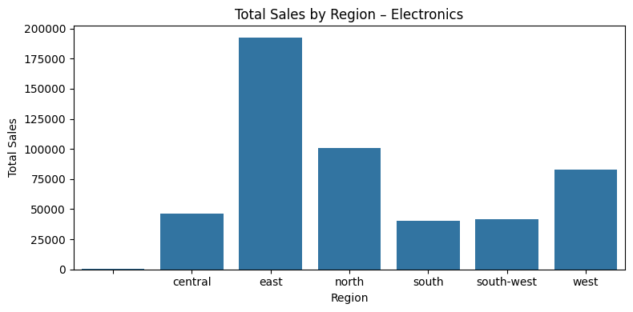
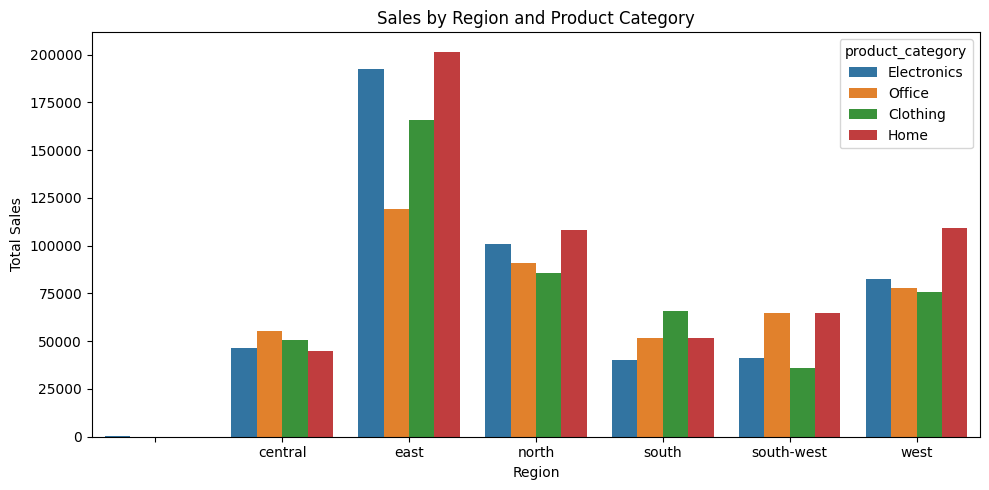
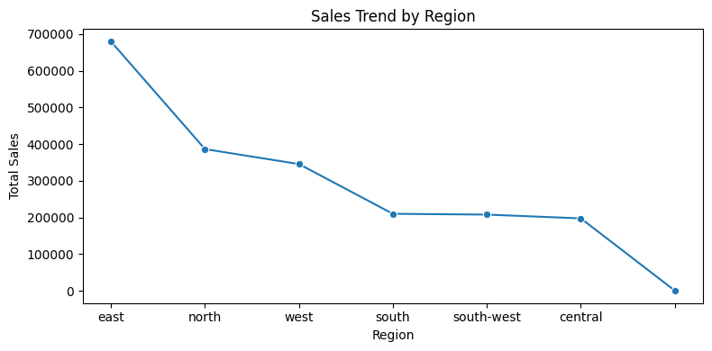
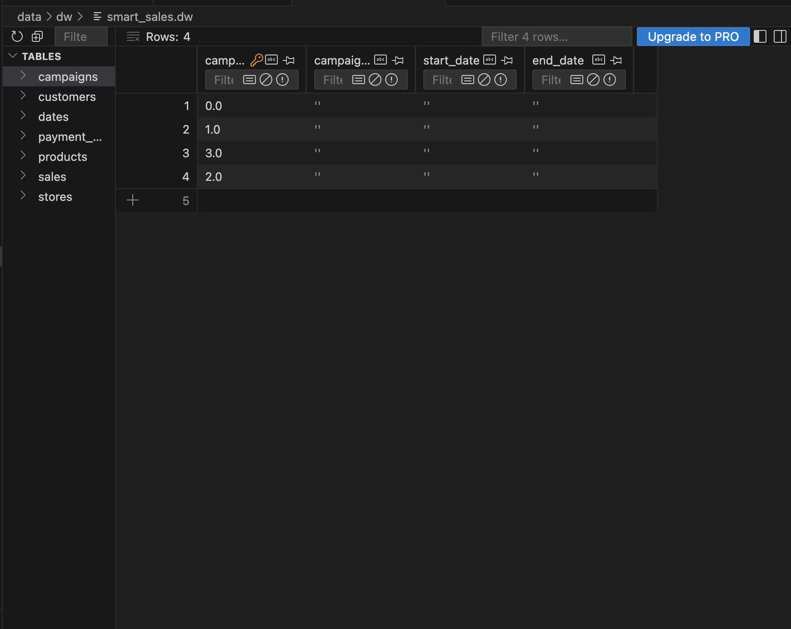

# Smart Sales Starter Files

> Start a BI pipeline by reading raw data into pandas DataFrames (a two-dimensional representation similar to an Excel sheet).

---

## WORKFLOW 1. Set Up Your Machine (DONE in P1)

Proper setup is critical. Follow earlier instructions to set up your machine.

---

## WORKFLOW 2. Set Up Your Project (DONE in P1)

We used these one-time commands when first starting the project.

```bash
uv python pin 3.12
uv venv
uv sync --extra dev --extra docs --upgrade
uv run pre-commit install
uv run python --version
```

**macOS / Linux / WSL:**

```bash
source .venv/bin/activate
```

---

## WORKFLOW 3. Daily Workflow

As we progress, we'll use this daily workflow often.

### 3.1 Git Pull from GitHub

Always start with:

```bash
git pull
```

### 3.2 Run Checks as You Work

Run these one at a time to keep your environment updated and code clean.

```bash
uv sync --extra dev --extra docs --upgrade
uv cache clean
git add .
uvx ruff check --fix
uvx pre-commit autoupdate
uv run pre-commit run --all-files
git add .
uv run pytest
```

### 3.3 Build Project Documentation

```bash
uv run mkdocs build --strict
uv run mkdocs serve
```

- After running the serve command, press **CMD + click** the local URL to open docs.
- Press **CTRL C** to stop the hosting process.

---

# P2: BI Python – Reading Raw Data into pandas DataFrames

## Overview

This project demonstrates how to use Python and pandas to load raw CSV data files into DataFrames as part of a BI workflow.

### Run the Data Preparation Module

```bash
uv run python -m analytics_project.data_prep
```

This command executes the module directly from the project root.
It reads each raw CSV file found in `data/raw/`, loads it into a pandas DataFrame, and logs the file name and shape.

---

## Results Summary

| File Name            | Rows | Columns |
|----------------------|------|----------|
| customers_data.csv   | 201  | 6        |
| products_data.csv    | 100  | 4        |
| sales_data.csv       | 2001 | 8        |

---

# P3: Prepare Data for ETL

## Objective

This stage focuses on **cleaning and preparing data for Extract, Transform, and Load (ETL)** processes.
The goal is to ensure all datasets are consistent, accurate, and ready for business intelligence (BI) use.

---

## Processing Steps

We combined all data cleaning logic into a single module (`data_prep.py`) that calls functions from `data_scrubber.py`.
The process standardized and validated all three datasets.

### Summary of Cleaning Actions

- Removed unnecessary columns (`FirstName`, `LastName`, `TenureDays`).
- Replaced `?` with appropriate defaults:
  - Numeric fields → `0`
  - Text fields → empty string `""`
- Preserved rows that had missing **LastPurchaseDate** (kept `<NA>` instead of deleting).
- Standardized text columns (capitalized region names, removed whitespace).
- Removed duplicate records.
- Confirmed all files exported cleanly to `data/clean`.

---

### Input and Output Files

| Input File | Clean Output File |
|-------------|-------------------|
| `data/raw/customers_data.csv` | `data/clean/customers_data_clean.csv` |
| `data/raw/products_data.csv`  | `data/clean/products_data_clean.csv` |
| `data/raw/sales_data.csv`     | `data/clean/sales_data_clean.csv` |

---

## Commands Used During Cleaning

```bash
# activate the environment
source .venv/bin/activate

# run the ETL preparation process
uv run python -m analytics_project.data_prep
```

This:
1. Loads all raw CSV files.
2. Cleans each dataset using the `DataScrubber` class.
3. Exports cleaned versions into `data/clean/`.
4. Prints before/after summaries for rows, nulls, and duplicates.

---

## Example Terminal Output

```
customers_data: rows 201 -> 201 | nulls 4 -> 4 | dupes 1 -> 0
products_data: rows 100 -> 100 | nulls 5 -> 0 | dupes 0 -> 0
sales_data: rows 2001 -> 2000 | nulls 2 -> 0 | dupes 1 -> 0
data preparation complete. Clean files are in data/clean
```

---

## Git Commands Used

```bash
git add .
git commit -m "Clean and prepare data for ETL – replaced ?, removed dupes, preserved NA"
git push -u origin main
```

---

## Notes and Lessons Learned

- Retaining `<NA>` values is essential for accurate analytics.
- Data cleaning consumed roughly **70% of project time**, matching industry norms.
- Using reusable modules (`data_scrubber` + `data_prep`) ensures consistent future ETL steps.

---

## Final Verification

```bash
ls data/clean/
```

Expected output:

```
customers_data_clean.csv
products_data_clean.csv
sales_data_clean.csv
```

---

**Next Step:** The cleaned files in `data/clean/` are now ready to be loaded into your ETL or BI workflow for analysis.

## P4: Create and Populate DW

> Build a SQLite Data Warehouse (DW) using the cleaned datasets, and validate the structure for analytics use.

---

### WORKFLOW 1. Overview

This stage creates a **SQLite Data Warehouse (DW)** using the cleaned CSVs from `data/clean/`.
The goal is to load, structure, and verify data for use in business intelligence analysis.

---

### WORKFLOW 2. Objective

- Connect to or create a SQLite database file (`smart_sales.dw`)
- Load all cleaned CSVs from `data/clean/`
- Create and populate dimension and fact tables
- Verify table structures and record counts

---

### WORKFLOW 3. Run the ETL Script

Activate the virtual environment and run the ETL script:

    source .venv/bin/activate
    python src/analytics_project/etl_to_dw.py

This script connects to the data warehouse and performs the following:

1. Loads all cleaned CSVs
2. Creates seven tables:
   - `dates`
   - `customers`
   - `products`
   - `stores`
   - `campaigns`
   - `payment_methods`
   - `sales`
3. Inserts all records and commits to the database

---

### WORKFLOW 4. Example Terminal Output

    Building DW at: data/dw/smart_sales.dw
    dates             -> 281 rows
    customers         -> 201 rows
    products          -> 100 rows
    stores            -> 4 rows
    campaigns         -> 4 rows
    payment_methods   -> 9 rows
    sales             -> 1999 rows
    Done.

---

### WORKFLOW 5. Validate the Data Warehouse (Task 3)

Use the **SQLite Viewer** extension in VS Code to confirm successful table creation and data population.

#### Steps

1. Install the **SQLite** extension by *alexcvzz*
2. Right-click `data/dw/smart_sales.dw` → **Open Database**
3. Review all tables and confirm record counts
4. Open each table to verify that data populated correctly

---

### WORKFLOW 6. Results Summary

| Table | Rows | Status |
|---|---:|:--:|
| dates | 281 | ✅ |
| customers | 201 | ✅ |
| products | 100 | ✅ |
| stores | 4 | ✅ |
| campaigns | 4 | ✅ |
| payment_methods | 9 | ✅ |
| sales | 1999 | ✅ |

---

### WORKFLOW 7. Notes and Lessons Learned

- Empty quotes (`""`) in some columns (e.g., campaigns) represent null or missing values — this is acceptable.
- The `.dw` file extension stands for **Data Warehouse** and functions the same as `.db`.
- The `etl_to_dw.py` script enforces **foreign key integrity** for accurate relational linking.
- The **SQLite Viewer** extension is a simple, effective tool to verify schema structure and data accuracy.

---

### WORKFLOW 8. Git Commands Used

    git add .
    git commit -m "Created and populated smart_sales.dw data warehouse with cleaned data"
    git push

---

### WORKFLOW 9. Final Verification

The Data Warehouse was successfully created and validated.
All tables were populated correctly, relationships verified, and record counts confirmed.

### WORKFLOW 10. Screenshots









**Next Step:** Proceed to document final BI analysis and visualization using the populated `smart_sales.dw` database.

<!-- ...existing code... -->

## Platform & tool choices (why these on my machine)

- OS: macOS Seqouia 15.6.1. I use the integrated Terminal and Finder shortcuts below.
- Editor: Visual Studio Code — lightweight, great notebook support and Python/Spark debugging.
- Python: 3.12 (managed via project tooling shown in this repo).
- Spark: pyspark + local SparkSession with SQLite JDBC (sqlite_jdbc-3.51.0.0.jar) — lets me query the DW (smart_sales.dw) using familiar SQL semantics at scale.
- Data storage: local SQLite DW for easy reproducible demos.
- Vizuals: Pandas + Seaborn / Matplotlib for quick charts inside notebooks.
- Optional BI: Power BI Desktop (Windows) or Power BI service — useful for model view and interactive reports; Spark outputs can also be exported for Power BI ingestion.

Quick macOS screenshot tips

## SQL queries & reports (what each cell does)

- Top customers
  - Query: GROUP BY customer name, SUM(SaleAmount) ORDER BY total DESC.
  - Purpose: identify high-value customers for targeting / cohort analysis.

- Sales by region
  - Query: GROUP BY customers.Region, SUM(SaleAmount).
  - Purpose: geographic performance and where to allocate spend.

- Region × Product Category (dice)
  - Query: GROUP BY customers.Region, products.Category, SUM(SaleAmount) ORDER BY region, total_sales DESC.
  - Purpose: two-dimensional view (region vs category) to spot strengths and opportunities.

- Slice operation
  - Operation: filter the dice result for a single product_category (example: Electronics).
  - Purpose: a focused regional comparison for that category.

- Drilldown operation
  - Operation: aggregate at region level and optionally break down by product (or customer) to examine drivers of region totals.
  - Purpose: move from summary to detail to troubleshoot or explain changes.

Example SQL snippets (as used in the notebook)
- Top customers:
  SELECT c.Name AS name, SUM(s.SaleAmount) AS total_spent
  FROM sales s JOIN customers c
    ON CAST(s.CustomerID AS STRING) = CAST(c.CustomerID AS STRING)
  GROUP BY c.Name
  ORDER BY total_spent DESC;

- Region × Category (dice):
  SELECT c.Region AS region, p.Category AS product_category, SUM(s.SaleAmount) AS total_sales
  FROM sales s
  JOIN customers c ON CAST(s.CustomerID AS STRING) = CAST(c.CustomerID AS STRING)
  JOIN products p ON s.ProductID = p.ProductID
  GROUP BY c.Region, p.Category
  ORDER BY c.Region, total_sales DESC;

## Screenshots

1. Slice result (filtered category)
   

2. Dice result (region × category)
   

3. Drilldown result (sales trend by region)
   

4. Spark SQL Schema
root
 |-- sale_id: integer (nullable = true)
 |-- date: string (nullable = true)
 |-- customer_id: string (nullable = true)
 |-- product_id: string (nullable = true)
 |-- store_id: string (nullable = true)
 |-- campaign_id: string (nullable = true)
 |-- payment_method_id: string (nullable = true)
 |-- quantity: integer (nullable = true)
 |-- sales_amount: double (nullable = true)

root
 |-- customer_id: string (nullable = true)
 |-- name: string (nullable = true)
 |-- region: string (nullable = true)
 |-- join_date: string (nullable = true)
 |-- last_purchase_date: string (nullable = true)
 |-- email_opt_in: integer (nullable = true)

root
 |-- product_id: string (nullable = true)
 |-- product_name: string (nullable = true)
 |-- category: string (nullable = true)
 |-- unit_price: double (nullable = true)
 |-- stock_level: integer (nullable = true)
 |-- discontinued: integer (nullable = true)

# Project 6 – BI Insights and Storytelling
### Kevin Hennelly

---

## 1. Business Goal
Analyze how customer email opt-in status affects sales performance and product/category engagement across regions, stores, and order value.

---

## 2. Data Source
- smart_sales.dw
- Tables: customers, sales, products, dates, stores, campaigns

---

## 3. Tools
- PySpark
- Pandas
- Seaborn / Matplotlib

---

## 4. Workflow & Logic

This section describes the analytical logic used to answer the business question. The workflow follows standard OLAP operations—slicing, dicing, and drilldown—to explore how customer email opt-in status relates to sales performance across regions, product categories, order values, and time.

### Dimensions Used
- **Email Opt-In Status** (Yes / No)
- **Region** (central, east, north, south, southwest, west)
- **Product Category** (Clothing, Electronics, Home, Office)
- **Order Value** (SaleAmount from the sales table)
- **Time** (Last purchase month, including 3-month rolling averages)

### Measures Used
- **Total Sales** (SUM of SaleAmount)
- **Customer Count** (COUNT DISTINCT CustomerID)
- **Order Value Distribution** (boxplot analysis)

### OLAP Operations Performed

#### Slicing
Single-dimension cuts to establish baseline patterns:
- Total sales by email opt-in status
- Distribution of order values by opt-in status

#### Dicing
Multi-dimensional combinations to uncover deeper structure:
- Sales by region × email opt-in
- Sales by product category × email opt-in
- Sales by region × product category
- Sales by region × product category × email opt-in (heatmap)

#### Drilldown
Progressively deeper exploration of segment behavior:
- **Level 1:** Email opt-in → product category
- **Level 2:** Product category → category-level sales by opt-in
- **Time-Based Drilldown:** Last purchase month → 3-month rolling trend → opt-in comparison over time

### Workflow Logic Summary
1. Began with slicing to compare opt-in vs. non-opt-in behavior.
2. Expanded into dicing to see how the relationship varies by region and product category.
3. Drilled deeper into product and time-based behavior to find the source of differences between segments.
4. Applied smoothing (3-month rolling) to identify stable patterns rather than month-to-month noise.
5. Use the combined slice → dice → drilldown approach to form a complete view of customer engagement and purchasing patterns.

# 5. Results

The OLAP analysis examined customer behavior across email opt-in status, regions, product categories, order values, and time. Slicing, dicing, and drilldown operations revealed consistent patterns in how different customer groups contribute to sales.  Most interesting is that customers that did not opt-in to email marketing were generally larger drivers of sales and revenue than those who did.  This is counterintuitive to most analysis of customers that opt in for emails. (Note: The data for this was randomly created with customers being assigned yes or no purley at random.  It does make for some interesting findings though)

---



## Slice — Total Sales by Email Opt-In Status

Total sales from customers who did not opt in to marketing emails (“No”) were higher than those from email opt-in customers (“Yes”). The non-opt-in group generated more total revenue and constituted the larger share of purchasing activity.

---


## Dice — Sales by Region and Email Opt-In

Regional splits showed that non-opt-in customers and opt-in customers each had three regions they were stronger in. Central, Southwest, and West were stronger for opt-in.  South, North and East were stronger for opt-out.  Of particular note is the South and North were much stronger for opt-out than opt-in.

---


## Dice — Sales by Product Category and Email Opt-In

Across major categories (Clothing, Electronics, Home, Office), non-opt-in customers generated more total sales than opt-in customers in every category. The gap was largest in the Home category, though consistent across all.

---


## Drilldown Level 1 — Category-Level Sales by Email Opt-In

Drilling down into category-level performance confirmed the same pattern: non-opt-in customers consistently generated higher sales in each category. Email opt-in customers did not lead in any category.

---


## Drilldown Level 2 — Product Category Within Each Opt-In Group

Examining the category mix within each opt-in group further reinforced this pattern. Non-opt-in customers purchased more in every category relative to opt-in customers.

---

## Distribution — Order Values by Email Opt-In

Order value distributions for both groups were similar, with no strong evidence that opt-in customers spend more per order. Median purchase amounts and ranges were nearly identical.

---


## Heatmaps — Category × Email Opt-In; Region × Email Opt-In

All heatmaps showed that revenue patterns were driven by a combination of geography and product mix. However, in heatmaps comparing email opt-in status, the non-opt-in group, with a few exceptions, generated the most revenue.

---


## 3-Month Rolling Trend — All Customers

The rolling monthly trend illustrated seasonal behavior with rising activity in the mid-year months and a subsequent decline. Smoothing clarified the timing of peak and low engagement periods.

---


## 3-Month Rolling Drilldown — Email Opt-In Over Time

The rolling drilldown revealed that non-opt-in customers consistently maintained higher activity over time. Even with smoothing, the gap between opt-in and non-opt-in customers remained steady, indicating a persistent behavioral difference rather than random fluctuation.

---

## Overall Finding

Across all slices, dice operations, categories, regions, and time-based analyses, non-opt-in customers were the primary contributors to revenue and activity. Email opt-in status did not correlate with higher engagement, stronger transaction values, or increased purchasing activity.


⸻

# 6. Suggested Business Action

Based on the findings, several actions are recommended to improve decision-making and capitalize on observed patterns:

A. The email marketing approach should be reevaluated. Since opt-in customers did not demonstrate higher activity, the current email content, segmentation, send frequency, or list hygiene may not be effective. Small, controlled tests should be used to measure whether adjustments improve engagement.

B. Non–opt-in customers represent the largest source of revenue and should receive more attention. Alternative engagement channels such as SMS, push notifications, loyalty program messaging, or in-app communication may be more appropriate to reach this group.  However, care should be taken as to not be too aggressive as their non-opt-in status for emails may reflect a desire for minimal engagement.  Other forms of engagement should also be opt-in with perhaps encouragement to opt-in (i.e. immediate discount on a purchase).

C. Marketing efforts should prioritize high-performing regions and categories. Regions such as the east and west, along with categories like Electronics and Home, offer opportunities for targeted promotions and inventory optimization. Region-category combinations with strong historical performance should be emphasized.

D. To support ongoing analysis, materialized OLAP aggregates should be created for combinations such as month × email opt-in, region × category, category × opt-in, and rolling-window metrics. This will ensure faster dashboard performance and consistent reporting across teams.

E. Any future email marketing experiments should begin with small, measurable tests to determine whether specific types of messaging or category-focused promotions can increase opt-in engagement. Findings should be validated before scaling up campaign efforts.


## 7. Challenges

During the project, several challenges arose that required additional troubleshooting and cleanup before the analysis could move forward. One of the primary issues was data quality. Some fields contained malformed dates, placeholder values such as “?” or empty strings, and customer IDs that did not match any records in the customers table. These issues caused errors during timestamp conversion and produced inaccurate aggregations until they were identified and filtered out.  I've learned I need to get better at the cleaning part.  While I've identified ways to show data is incomplete or missing, it seems to consistently cause issues downstream.  I think with more practice I will get better at properly identifying missing or incomplete errors so it doesn't cause any parsing errors or odd looking charts with "stray" data.

Another challenge involved inconsistent formatting of the email opt-in field. Early in the process, values appeared as 0/1, “Yes”/“No”, and in some cases null. Standardizing these values ensured that slicing, dicing, and drilldown comparisons were accurate and visually consistent across visualizations.  I could've (should've?) fixed this in the cleaning.  Changing 1, 0 to yes, no is easy to do once there instead of each time here.

Time-based charts also presented difficulties due to dense monthly labels and uneven purchase activity. The initial month-by-month trend was cluttered and hard to interpret. Switching to a three-month rolling view improved readability and provided a clearer picture of customer behavior over time.

Finally, some visualizations required adjustment to achieve consistent scaling and layout, especially when placing multiple charts together in the notebook. These refinements ensured that the final presentation was clean, readable, and aligned with the project requirements.
